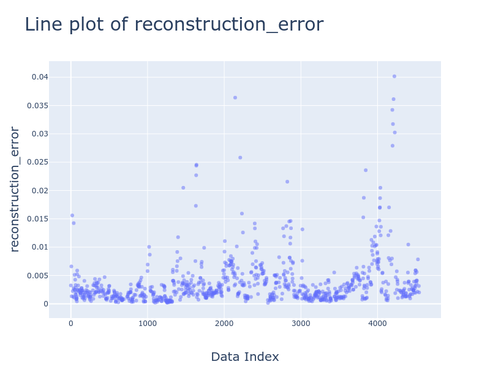
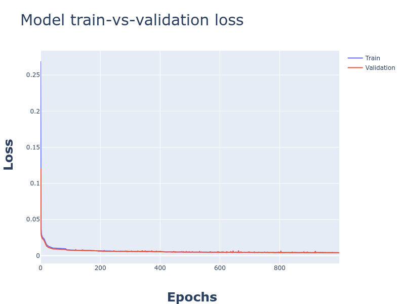

# Anomaly Detection Using Autoencoder

# Idea:
The idea is to employ deep learning method (autoencoder) to build a classification model on the JADS dataset, which will be trained on normal samples. The resulting classifier will be able to distinguish between a normal and anomalous sample. 

# How it works:
Using a training set of just legitimate transactions, we teach a machine learning algorithm to reproduce the feature vector of each transaction. Then we perform a reality check on such a reproduction. If the distance between the original transaction and the reproduced transaction is below a given threshold, the transaction is considered legitimate; otherwise it is considered a fraud candidate.

# Autoencoder:
An autoencoder is a feed-forward multilayer neural network that reproduces the input data on the output layer. So, the number of output units must be the same as the number of input units. The autoencoder is here trained using the backpropagation algorithm againstthe mean squared error (MSE) loss function.

# Implementation:
The implementation is coded in Python using Keras for building and training the model and Panda for data manipulation.
 Jheronimus Academy of Data Science (JADS) career day dataset has been used for the training and testing purpose. 
 
 

Credits : https://bit.ly/2zpf1nd
